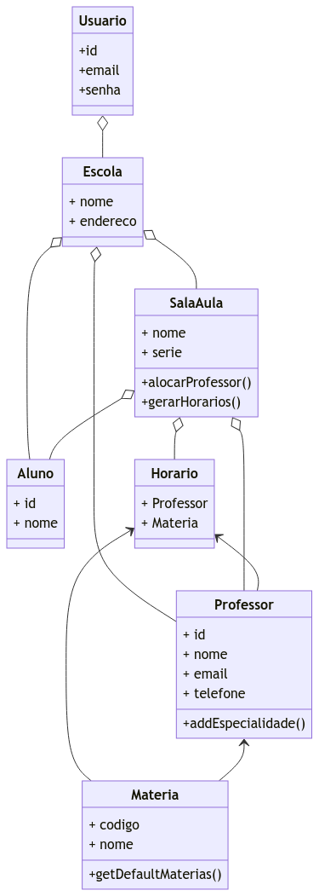

# SmartClass

## Objetivo

O objetivo deste projeto é desenvolver um sistema escolar que permita a
administração de uma escola. Entre as principais funcionalidades, está a
geração de escalonamento de horários para professores e turmas, além da gestão
de alunos, professores e disciplinas, visando a otimização do dia a dia
escolar.

## Principais Features

- Geração automática de escalonamento de horários.
- Gestão de turmas, professores e alunos.
- Interface intuitiva para usuários administrativos.
- Integração com banco de dados para armazenamento e consulta de dados.

## Membros da Equipe

- Jalmir de Jesus Ferreira da Silva Junior - Full Stack Developer
- João Victor Taufner Pereira - Backend Developer
- Diogo do Nascimento Rodrigues - Full Stack Developer
- Christian Felippe Vasconcelos de Oliveira - Backend Developer

## Tecnologias Utilizadas

- Linguagem: JavaScript/TypeScript
- Backend Framework: Express.js
- Frontend Framework: Next.js
- Banco de Dados: PostgreSQL
- Conteinerização e orquestração: Docker e Docker Compose

## Backlog do produto
- Como aluno, eu gostaria de me cadastrar na escola em que estudo.
- Como aluno, eu gostaria de visualizar os horários de todas as minhas aulas.
- Como aluno, eu gostaria de acessar minhas notas por disciplina, com detalhamento por atividades e provas.
- Como aluno, eu gostaria de consultar minhas faltas por disciplina, com alertas caso eu esteja perto do limite permitido.
- Como aluno, eu gostaria de baixar boletins, atestados de matrícula e outros documentos.
- Como professor, eu gostaria de me cadastrar nas escolas em que dou aula.
- Como professor, eu gostaria de acessar todas as disciplinas que sou responsável.
- Como professor, eu gostaria de acessar meu quadro de horários.
- Como professor, eu gostaria de inserir as notas dos meus alunos.
- Como diretor, eu gostaria de cadastrar minha escola no sistema.
- Como diretor, eu gostaria de adicionar novas disciplinas ao currículo da escola.
- Como diretor, eu gostaria de alocar professores de acordo com suas áreas de especialidade para cada disciplina.
- Como diretor, eu gostaria de gerar automaticamente o quadro de horários de toda a escola.
- Como diretor, eu gostaria de gerenciar a criação e a divisão de turmas.
 
 ## Backlog da sprint

História #1: Como diretor, eu gostaria de gerenciar a criação e a divisão de turmas.
- Implementar as operações de CRUD de diretores.
- Criar a tela de registro de diretores.
- Criar a tela inicial para diretores.
- Implementar as operações de CRUD de escolas.
- Criar a tela de registro de escola.

Historia #2: Como diretor, eu gostaria de gerar automaticamente o quadro de horários de toda a escola.
- Criar a tabela de horarios.
- Implementar as operações gerar quadro de horarios.
- Criar a tela de quadro de horarios.

Historia #3: Como diretor, eu gostaria de alocar professores de acordo com suas áreas de especialidade para cada disciplina.
- Implementar as operações de CRUD de professores.
- Criar a tela de registro de professor.
- Criar a tela inicial para professores.
- Criar a tabela de disciplinas
- Implementar as operações de CRUD de discplinas.

Historia #4: Como professor, eu gostaria de me cadastrar nas escolas em que dou aula.
- Criar a tabela de professores.
- Implementar as operações de CRUD de discplinas.
- Criar a tela inicial para professores.

